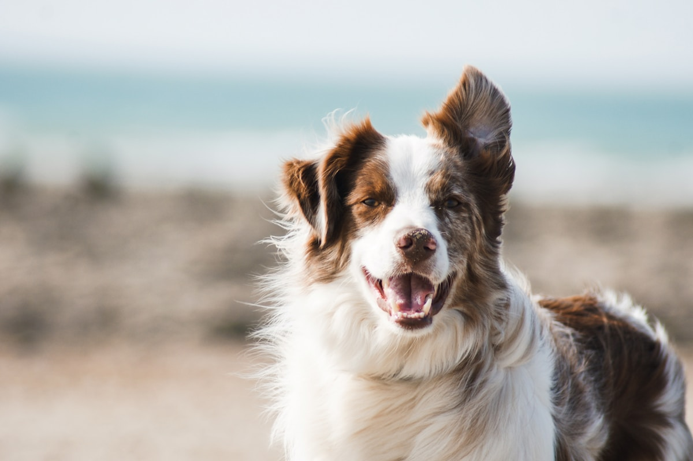
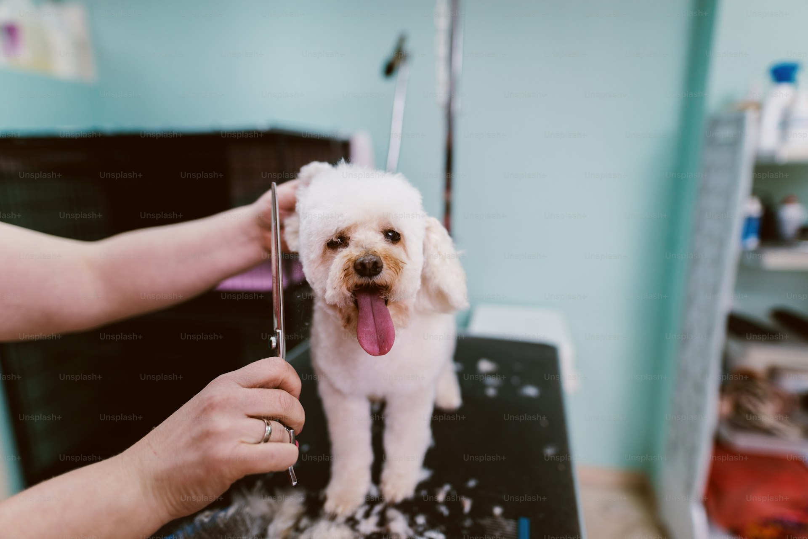
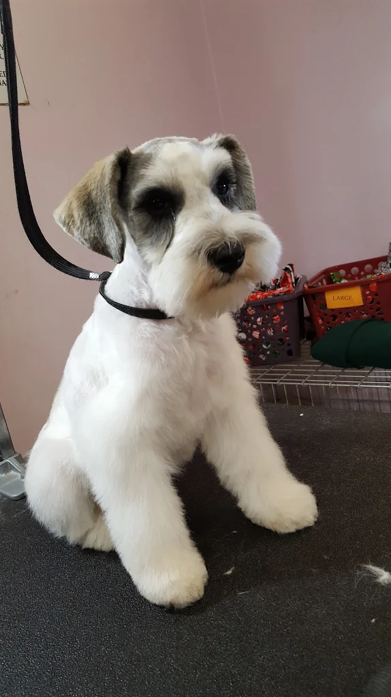
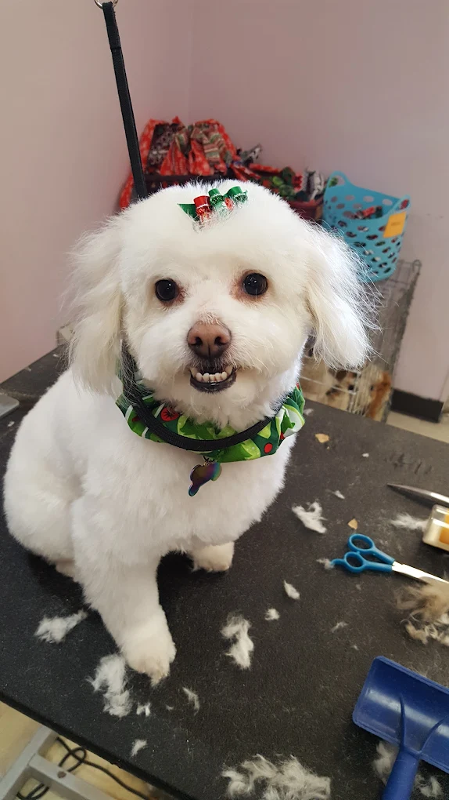
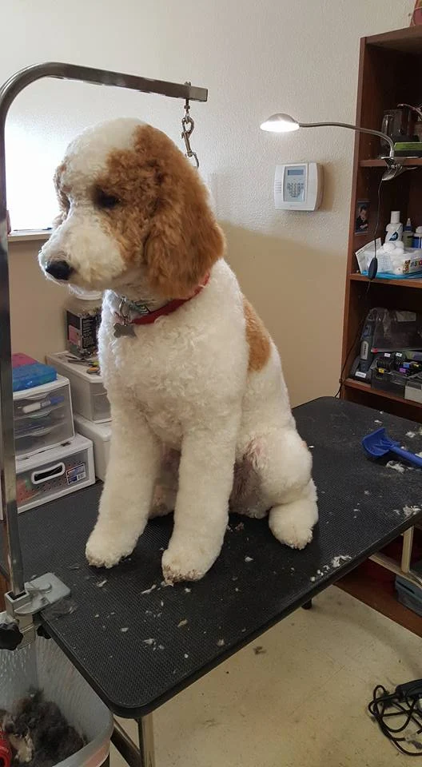

# Premium Design Research — Passion For Pets Upgrade

## Research Date: March 10, 2026
## Purpose: Specific, actionable design patterns to make this site look like a $5K-$15K custom build

---

## 1. TYPOGRAPHY SYSTEM

### The Rule: Two Fonts, Maximum Contrast

Premium sites never use one font for everything. They pair a **display serif** for headlines with a **clean sans-serif** for body. The contrast between them is what creates visual sophistication.

### Recommended Pairing for This Build

**Headlines:** `Playfair Display` (Google Fonts)
- H1: `font-size: clamp(2.75rem, 5vw, 4.5rem)` / `font-weight: 700` / `letter-spacing: -0.03em` / `line-height: 1.05`
- H2: `font-size: clamp(2rem, 3.5vw, 3rem)` / `font-weight: 700` / `letter-spacing: -0.02em` / `line-height: 1.1`
- H3: `font-size: clamp(1.25rem, 2vw, 1.75rem)` / `font-weight: 600` / `line-height: 1.2`

**Body:** `Inter` (Google Fonts)
- Body: `font-size: 1.125rem (18px)` / `font-weight: 400` / `line-height: 1.7` / `letter-spacing: 0`
- Small/Labels: `font-size: 0.875rem` / `font-weight: 500` / `letter-spacing: 0.05em` / `text-transform: uppercase`

**Tailwind implementation:**
```html
<!-- In <head> -->
<link href="https://fonts.googleapis.com/css2?family=Playfair+Display:wght@400;600;700&family=Inter:wght@300;400;500;600&display=swap" rel="stylesheet">

<!-- Tailwind config extension -->
<script>
tailwind.config = {
  theme: {
    extend: {
      fontFamily: {
        'display': ['"Playfair Display"', 'Georgia', 'serif'],
        'body': ['Inter', 'system-ui', 'sans-serif'],
      }
    }
  }
}
</script>

<!-- Usage -->
<h1 class="font-display text-5xl md:text-7xl font-bold tracking-tight leading-none">
  Where Every Pet<br>
  <em class="italic">Is Family</em>
</h1>
<p class="font-body text-lg text-gray-600 leading-relaxed">
  Gilbert's most trusted grooming salon since 2007.
</p>
```

### Typography Tricks That Separate Custom From Template

1. **Italicized accent words in headlines** — One word in the H1 gets `font-style: italic` to create visual interest. Playfair Display italic is gorgeous.
2. **Eyebrow text above headlines** — Small, uppercase, wide-tracked sans-serif label: `text-sm font-medium tracking-widest uppercase text-amber-600`
3. **Variable font sizing** — Use `clamp()` instead of fixed breakpoints. Text scales smoothly.
4. **Negative letter-spacing on large text** — `tracking-tight` (-0.025em) or `tracking-tighter` (-0.05em) on H1/H2. Makes large type feel intentional.
5. **Light font weight for large decorative text** — Background numbers or section labels at `font-weight: 300` and massive size.

### Alternative Premium Pairings (If Playfair Feels Wrong)

| Heading Font | Body Font | Vibe |
|---|---|---|
| `DM Serif Display` + `DM Sans` | Warm, approachable luxury | Good for pet business |
| `Cormorant Garamond` + `Montserrat` | Editorial, magazine-like | High-fashion feel |
| `Libre Baskerville` + `Source Sans Pro` | Classic, trustworthy | More conservative |
| `Fraunces` + `Inter` | Modern, playful luxury | Younger demographic |

---

## 2. COLOR SYSTEM

### What Premium Sites Do Differently

Template sites use 5-6 colors randomly. Premium sites use **2-3 colors max** with very intentional application. The restraint IS the luxury.

### Recommended Palette for Passion For Pets

```
Primary:        #1B3A4B  (deep teal-navy — trust, premium)
Accent:         #C8956C  (warm gold/caramel — warmth, luxury, ties to pet coats)
Cream BG:       #FDFAF6  (warm off-white — NOT pure white)
Dark BG:        #0F1F2B  (near-black for contrast sections)
Text Primary:   #1A1A1A  (soft black — never #000000)
Text Secondary: #6B7280  (muted gray for supporting text)
Light Accent:   #F5EDE4  (warm beige for card backgrounds)
Success/CTA:    #2D7A5F  (deep sage green — Book Now buttons)
```

### Color Rules

1. **Never use pure white (#FFFFFF) as background** — Use #FDFAF6 or #FAFAF8. The warmth makes everything feel more expensive.
2. **Never use pure black (#000000) for text** — Use #1A1A1A or #1E293B. Pure black is harsh.
3. **One accent color, used sparingly** — The gold/caramel appears on: eyebrow text, decorative lines, hover states, and ONE CTA. Not everywhere.
4. **Dark sections for contrast rhythm** — Every 2-3 sections, drop in a dark (#0F1F2B) section. Light-dark-light-dark creates visual rhythm.
5. **Background color shifts between sections** — Alternate between #FDFAF6, #F5EDE4, #FFFFFF, and dark. Never two identical backgrounds in a row.

### Tailwind Implementation

```html
<script>
tailwind.config = {
  theme: {
    extend: {
      colors: {
        'brand': {
          50: '#F5EDE4',
          100: '#FDFAF6',
          200: '#E8D5C4',
          500: '#C8956C',
          700: '#1B3A4B',
          900: '#0F1F2B',
        }
      }
    }
  }
}
</script>
```

---

## 3. HERO SECTION — THE MONEY SHOT

### What $5K+ Sites Do

They do NOT do "text left, image right, CTA below." That's the single most common template pattern.

### Option A: Editorial Split with Asymmetric Image (Recommended)

The image bleeds off the edge. Text has massive typography. Elements overlap.

```html
<section class="relative min-h-screen bg-brand-100 overflow-hidden">
  <!-- Decorative background number -->
  <div class="absolute top-20 left-8 font-display text-[20rem] font-light text-brand-50 leading-none select-none opacity-60">
    17
  </div>

  <!-- Content grid -->
  <div class="relative max-w-7xl mx-auto px-6 pt-32 pb-20 grid lg:grid-cols-12 gap-8 items-end min-h-screen">

    <!-- Text column — takes 5 cols, sits lower -->
    <div class="lg:col-span-5 lg:pb-20 z-10">
      <span class="font-body text-sm font-medium tracking-widest uppercase text-brand-500">
        Gilbert's Premier Pet Salon
      </span>
      <h1 class="font-display text-5xl md:text-7xl font-bold tracking-tight leading-none mt-4 text-brand-900">
        Where Every Pet<br>
        <em class="italic text-brand-700">Is Family</em>
      </h1>
      <p class="font-body text-lg text-gray-600 leading-relaxed mt-6 max-w-md">
        Hand-dried, cage-free grooming by professionals with 15-30 years of experience. Serving Gilbert since 2007.
      </p>
      <div class="flex flex-wrap gap-4 mt-8">
        <a href="tel:4809261424" class="bg-brand-700 text-white px-8 py-4 rounded-full font-body font-medium text-sm tracking-wide hover:bg-brand-900 transition-all duration-300 hover:shadow-lg hover:shadow-brand-700/20 hover:-translate-y-0.5">
          Call (480) 926-1424
        </a>
        <a href="#services" class="border-2 border-brand-700 text-brand-700 px-8 py-4 rounded-full font-body font-medium text-sm tracking-wide hover:bg-brand-700 hover:text-white transition-all duration-300">
          View Services
        </a>
      </div>
    </div>

    <!-- Image column — takes 7 cols, taller, offset -->
    <div class="lg:col-span-7 relative">
      <!-- Main image with clip-path shape -->
      <div class="relative rounded-3xl overflow-hidden shadow-2xl" style="clip-path: polygon(8% 0, 100% 0, 100% 100%, 0 100%);">
        
      </div>

      <!-- Floating stats card — overlaps image -->
      <div class="absolute -bottom-6 -left-8 bg-white rounded-2xl shadow-xl p-6 z-20">
        <div class="flex items-center gap-4">
          <div class="w-12 h-12 bg-brand-500/10 rounded-full flex items-center justify-center">
            <span class="text-brand-500 text-xl">★</span>
          </div>
          <div>
            <div class="font-display text-2xl font-bold text-brand-900">4.7</div>
            <div class="font-body text-sm text-gray-500">177+ Reviews</div>
          </div>
        </div>
      </div>

      <!-- Floating badge — upper area -->
      <div class="absolute -top-4 right-12 bg-brand-700 text-white rounded-full px-5 py-2 font-body text-sm font-medium shadow-lg">
        Since 2007
      </div>
    </div>
  </div>
</section>
```

### Option B: Full-Bleed Image with Overlay Text

Video or large image takes entire viewport. Text overlays with gradient.

```html
<section class="relative h-screen overflow-hidden">
  
  <!-- Gradient overlay — NOT just black. Use brand color. -->
  <div class="absolute inset-0 bg-gradient-to-r from-brand-900/90 via-brand-900/60 to-transparent"></div>

  <div class="relative max-w-7xl mx-auto px-6 h-full flex items-center">
    <div class="max-w-xl">
      <span class="font-body text-sm tracking-widest uppercase text-brand-500">Est. 2007</span>
      <h1 class="font-display text-5xl md:text-7xl font-bold text-white leading-none mt-4">
        The Art of<br>
        <em class="italic">Pet Grooming</em>
      </h1>
      <p class="font-body text-lg text-white/80 mt-6 leading-relaxed">
        Hand-dried. Cage-free. Six master groomers with over 100 years of combined experience.
      </p>
      <a href="tel:4809261424" class="inline-block mt-8 bg-brand-500 text-white px-8 py-4 rounded-full font-body font-medium hover:bg-brand-500/90 transition-all">
        Book Your Visit
      </a>
    </div>
  </div>

  <!-- Scroll indicator -->
  <div class="absolute bottom-8 left-1/2 -translate-x-1/2 flex flex-col items-center text-white/50">
    <span class="font-body text-xs tracking-widest uppercase mb-2">Scroll</span>
    <div class="w-px h-12 bg-white/30 relative overflow-hidden">
      <div class="w-full h-1/2 bg-white/80 animate-scroll-line"></div>
    </div>
  </div>
</section>
```

### Option C: Magazine-Style Collage Hero

Multiple images at different sizes with text woven between them — editorial feel.

```html
<section class="relative bg-brand-100 pt-32 pb-20 overflow-hidden">
  <div class="max-w-7xl mx-auto px-6">
    <!-- Massive headline spanning full width -->
    <h1 class="font-display text-6xl md:text-8xl lg:text-9xl font-bold tracking-tighter text-brand-900 leading-none">
      A Passion<br>For <em class="italic text-brand-500">Pets</em>
    </h1>

    <!-- Image collage grid below -->
    <div class="grid grid-cols-12 gap-4 mt-12">
      <div class="col-span-5 rounded-2xl overflow-hidden h-80">
        
      </div>
      <div class="col-span-4 rounded-2xl overflow-hidden h-80 mt-12">
        
      </div>
      <div class="col-span-3 flex flex-col justify-center">
        <p class="font-body text-lg text-gray-600 leading-relaxed">
          Gilbert's most trusted grooming salon. Hand-dried, cage-free, 17+ years of love.
        </p>
        <a href="tel:4809261424" class="mt-6 inline-flex items-center gap-2 font-body font-medium text-brand-700 hover:text-brand-500 transition-colors">
          Book Today <span>&rarr;</span>
        </a>
      </div>
    </div>
  </div>
</section>
```

---

## 4. SECTION TRANSITIONS — Killing the Flat Stack

### What Templates Do Wrong

Every section is a flat rectangle stacked on another flat rectangle. Same padding. Same background. Same layout. The eye has nothing to grab onto.

### Technique 1: Curved/Wave Dividers (CSS Only)

```html
<!-- Place between sections -->
<div class="relative">
  <svg class="w-full h-16 md:h-24" viewBox="0 0 1200 120" preserveAspectRatio="none">
    <path d="M0,60 C200,120 400,0 600,60 C800,120 1000,0 1200,60 L1200,120 L0,120 Z"
          fill="#0F1F2B"></path>
  </svg>
</div>
```

### Technique 2: Overlapping Sections

Make one section's content overlap into the next by using negative margins or absolute positioning.

```html
<section class="bg-brand-100 pb-32">
  <!-- Content -->
</section>
<section class="bg-brand-900 pt-8">
  <!-- Cards that pull UP into previous section -->
  <div class="max-w-7xl mx-auto px-6 -mt-24 relative z-10">
    <div class="grid md:grid-cols-3 gap-6">
      <!-- Cards here sit on top of both sections -->
    </div>
  </div>
</section>
```

### Technique 3: Angled Section Breaks

```css
.angled-section {
  clip-path: polygon(0 0, 100% 4%, 100% 100%, 0 96%);
  padding-top: 6rem;
  padding-bottom: 6rem;
}
```

### Technique 4: Background Color Rhythm

```
Section 1 (Hero):    #FDFAF6 (warm cream)
Section 2 (Trust):   #FFFFFF (white — marquee strip)
Section 3 (Services):#FDFAF6 (warm cream)
Section 4 (About):   #0F1F2B (dark) ← contrast break
Section 5 (Gallery): #1B3A4B (dark teal)
Section 6 (Reviews): #FDFAF6 (warm cream)
Section 7 (FAQ):     #F5EDE4 (warm beige) ← subtle shift
Section 8 (CTA):     #0F1F2B (dark)
Section 9 (Contact): #FDFAF6 (warm cream)
Footer:              #0F1F2B (dark)
```

---

## 5. SERVICE CARDS — Beyond the Grid

### What $5K Sites Do

They don't just show 6 identical cards in a 3x2 grid. They create hierarchy, visual interest, and break the pattern.

### Pattern 1: Featured + Grid Hybrid

One service gets a large "featured" card (full width, image + text side-by-side). The rest get smaller cards below it.

```html
<!-- Featured service — full width -->
<div class="bg-white rounded-3xl overflow-hidden shadow-lg grid md:grid-cols-2">
  <div class="p-10 md:p-14 flex flex-col justify-center">
    <span class="font-body text-xs tracking-widest uppercase text-brand-500 font-medium">Signature Service</span>
    <h3 class="font-display text-3xl font-bold text-brand-900 mt-2">Full Grooming</h3>
    <p class="font-body text-gray-600 mt-4 leading-relaxed">
      Bath, haircut, blow-dry by hand (never cage-dried), nails, ears, and finishing touches. Your pet leaves looking and feeling their best.
    </p>
    <a href="#contact" class="mt-6 inline-flex items-center gap-2 font-body font-medium text-brand-700 group">
      Book This Service
      <span class="group-hover:translate-x-1 transition-transform">&rarr;</span>
    </a>
  </div>
  <div class="h-64 md:h-auto">
    
  </div>
</div>

<!-- Smaller service cards below -->
<div class="grid md:grid-cols-3 gap-6 mt-6">
  <!-- Individual cards -->
  <div class="bg-white rounded-2xl p-8 shadow-sm hover:shadow-lg transition-shadow duration-500 group border border-gray-100">
    <span class="font-display text-5xl font-light text-brand-50 group-hover:text-brand-500/20 transition-colors duration-500">02</span>
    <h3 class="font-display text-xl font-bold text-brand-900 mt-2">Bath & Brush</h3>
    <p class="font-body text-gray-600 mt-2 text-sm leading-relaxed">Deep clean, de-shed, and hand blow-dry without the full haircut.</p>
  </div>
  <!-- More cards... -->
</div>
```

### Pattern 2: Alternating Layout (Left/Right Zigzag)

Each service alternates image-left/text-right, then text-left/image-right. Creates visual rhythm.

```html
<!-- Service 1: Image Left -->
<div class="grid md:grid-cols-2 gap-12 items-center">
  <div class="rounded-2xl overflow-hidden">
    
  </div>
  <div>
    <span class="font-body text-xs tracking-widest uppercase text-brand-500">01</span>
    <h3 class="font-display text-2xl font-bold mt-1">Full Grooming</h3>
    <p class="font-body text-gray-600 mt-3 leading-relaxed">...</p>
  </div>
</div>

<!-- Service 2: Image Right (reverse order on desktop) -->
<div class="grid md:grid-cols-2 gap-12 items-center mt-16">
  <div class="md:order-2 rounded-2xl overflow-hidden">
    
  </div>
  <div class="md:order-1">
    <span class="font-body text-xs tracking-widest uppercase text-brand-500">02</span>
    <h3 class="font-display text-2xl font-bold mt-1">Bath & Brush</h3>
    <p class="font-body text-gray-600 mt-3 leading-relaxed">...</p>
  </div>
</div>
```

### Pattern 3: Bento Grid

Different sized cards creating a magazine-like grid.

```html
<div class="grid md:grid-cols-4 gap-4">
  <!-- Large card spans 2 cols -->
  <div class="md:col-span-2 md:row-span-2 bg-brand-700 rounded-3xl p-10 text-white relative overflow-hidden">
    <span class="text-xs tracking-widest uppercase text-brand-500">Featured</span>
    <h3 class="font-display text-3xl font-bold mt-2">Full Grooming</h3>
    <p class="text-white/70 mt-3">Complete head-to-tail service...</p>
    
  </div>
  <!-- Standard card -->
  <div class="bg-white rounded-3xl p-8 border border-gray-100">
    <h3 class="font-display text-xl font-bold">Bath & Brush</h3>
    <p class="text-gray-600 mt-2 text-sm">...</p>
  </div>
  <!-- Standard card -->
  <div class="bg-brand-50 rounded-3xl p-8">
    <h3 class="font-display text-xl font-bold">Nail Care</h3>
    <p class="text-gray-600 mt-2 text-sm">...</p>
  </div>
  <!-- Wide card spans 2 cols -->
  <div class="md:col-span-2 bg-brand-900 rounded-3xl p-8 text-white">
    <h3 class="font-display text-xl font-bold">Cat Grooming</h3>
    <p class="text-white/70 mt-2 text-sm">One of the few salons in Gilbert that grooms cats...</p>
  </div>
</div>
```

---

## 6. PHOTO GALLERY — Editorial vs Template

### Template Approach (What To Avoid)
- Equal-sized squares in a 4-column grid
- No hover effects
- Generic lightbox popup
- "Gallery" as the section title with nothing else

### Premium Approach: Magazine Masonry

```html
<section class="bg-brand-900 py-24">
  <div class="max-w-7xl mx-auto px-6">
    <div class="flex items-end justify-between mb-12">
      <div>
        <span class="font-body text-sm tracking-widest uppercase text-brand-500">Our Work</span>
        <h2 class="font-display text-4xl md:text-5xl font-bold text-white mt-2">
          Happy Pets,<br><em class="italic">Happy Parents</em>
        </h2>
      </div>
      <p class="font-body text-white/50 max-w-xs text-sm hidden md:block">
        Real results from our Gilbert grooming salon. No filters, just fresh cuts.
      </p>
    </div>

    <!-- Masonry Grid -->
    <div class="columns-2 md:columns-3 gap-4 space-y-4">
      <div class="break-inside-avoid rounded-2xl overflow-hidden group relative">
        
        <!-- Optional overlay on hover -->
        <div class="absolute inset-0 bg-brand-900/0 group-hover:bg-brand-900/30 transition-colors duration-500 flex items-end p-4">
          <span class="font-body text-white text-sm opacity-0 group-hover:opacity-100 transition-opacity duration-500 translate-y-2 group-hover:translate-y-0">
            Schnauzer — Fresh cut by Holly
          </span>
        </div>
      </div>
      <!-- More images with varying heights... -->
      <div class="break-inside-avoid rounded-2xl overflow-hidden group relative">
        
      </div>
      <!-- The varying natural heights of images creates the masonry effect -->
    </div>
  </div>
</section>
```

### Key Differences That Make Gallery Feel Editorial

1. **Rounded corners (rounded-2xl)** — Not sharp squares
2. **Hover zoom (scale-105)** — Slow, 700ms transition
3. **Hover overlay with caption** — Text slides up from bottom
4. **Masonry layout (CSS columns)** — Different heights, magazine feel
5. **Dark background section** — Photos pop against dark
6. **Descriptive section header** — Not just "Gallery" but a headline + supporting text
7. **Minimal gap (gap-4)** — Tight grid feels intentional

---

## 7. ANIMATIONS & MICRO-INTERACTIONS

### The Rule: Purposeful, Not Performative

Template sites add `fadeIn` to everything. Premium sites use animation to guide attention and create delight.

### Scroll Reveal System (Vanilla JS + CSS)

```css
/* Base state — elements start invisible and slightly below */
.reveal {
  opacity: 0;
  transform: translateY(30px);
  transition: opacity 0.8s cubic-bezier(0.16, 1, 0.3, 1),
              transform 0.8s cubic-bezier(0.16, 1, 0.3, 1);
}

.reveal.is-visible {
  opacity: 1;
  transform: translateY(0);
}

/* Stagger children */
.reveal-stagger > * {
  opacity: 0;
  transform: translateY(20px);
  transition: opacity 0.6s cubic-bezier(0.16, 1, 0.3, 1),
              transform 0.6s cubic-bezier(0.16, 1, 0.3, 1);
}

.reveal-stagger.is-visible > *:nth-child(1) { transition-delay: 0ms; opacity: 1; transform: translateY(0); }
.reveal-stagger.is-visible > *:nth-child(2) { transition-delay: 100ms; opacity: 1; transform: translateY(0); }
.reveal-stagger.is-visible > *:nth-child(3) { transition-delay: 200ms; opacity: 1; transform: translateY(0); }
.reveal-stagger.is-visible > *:nth-child(4) { transition-delay: 300ms; opacity: 1; transform: translateY(0); }
.reveal-stagger.is-visible > *:nth-child(5) { transition-delay: 400ms; opacity: 1; transform: translateY(0); }
.reveal-stagger.is-visible > *:nth-child(6) { transition-delay: 500ms; opacity: 1; transform: translateY(0); }

/* Slide from left */
.reveal-left {
  opacity: 0;
  transform: translateX(-40px);
  transition: opacity 0.8s cubic-bezier(0.16, 1, 0.3, 1),
              transform 0.8s cubic-bezier(0.16, 1, 0.3, 1);
}
.reveal-left.is-visible {
  opacity: 1;
  transform: translateX(0);
}

/* Slide from right */
.reveal-right {
  opacity: 0;
  transform: translateX(40px);
  transition: opacity 0.8s cubic-bezier(0.16, 1, 0.3, 1),
              transform 0.8s cubic-bezier(0.16, 1, 0.3, 1);
}
.reveal-right.is-visible {
  opacity: 1;
  transform: translateX(0);
}

/* Clip-path reveal — image wipes in from left */
.reveal-clip {
  clip-path: inset(0 100% 0 0);
  transition: clip-path 1s cubic-bezier(0.16, 1, 0.3, 1);
}
.reveal-clip.is-visible {
  clip-path: inset(0 0 0 0);
}

/* Respect reduced motion */
@media (prefers-reduced-motion: reduce) {
  .reveal, .reveal-left, .reveal-right, .reveal-stagger > * {
    opacity: 1;
    transform: none;
    transition: none;
  }
  .reveal-clip { clip-path: none; }
}
```

```javascript
// Intersection Observer — fires once when element enters viewport
const revealElements = document.querySelectorAll('.reveal, .reveal-left, .reveal-right, .reveal-stagger, .reveal-clip');

const revealObserver = new IntersectionObserver((entries) => {
  entries.forEach(entry => {
    if (entry.isIntersecting) {
      entry.target.classList.add('is-visible');
      revealObserver.unobserve(entry.target); // only animate once
    }
  });
}, {
  threshold: 0.15,
  rootMargin: '0px 0px -50px 0px'
});

revealElements.forEach(el => revealObserver.observe(el));
```

### Premium Hover Effects

**Button hover — lift + shadow:**
```css
.btn-primary {
  transition: all 0.3s cubic-bezier(0.16, 1, 0.3, 1);
}
.btn-primary:hover {
  transform: translateY(-2px);
  box-shadow: 0 10px 25px -5px rgba(27, 58, 75, 0.25);
}
```

**Card hover — lift + subtle scale:**
```css
.service-card {
  transition: transform 0.5s cubic-bezier(0.16, 1, 0.3, 1),
              box-shadow 0.5s cubic-bezier(0.16, 1, 0.3, 1);
}
.service-card:hover {
  transform: translateY(-4px);
  box-shadow: 0 20px 40px -12px rgba(0, 0, 0, 0.1);
}
```

**Link hover — underline grows from left:**
```css
.link-reveal {
  position: relative;
}
.link-reveal::after {
  content: '';
  position: absolute;
  bottom: -2px;
  left: 0;
  width: 0;
  height: 2px;
  background: currentColor;
  transition: width 0.3s cubic-bezier(0.16, 1, 0.3, 1);
}
.link-reveal:hover::after {
  width: 100%;
}
```

**Image hover — slow zoom with overlay:**
```css
.img-hover-zoom img {
  transition: transform 0.7s cubic-bezier(0.16, 1, 0.3, 1);
}
.img-hover-zoom:hover img {
  transform: scale(1.05);
}
```

**Arrow slides right on hover (for "Learn More" links):**
```html
<a class="group inline-flex items-center gap-2">
  Learn More
  <span class="group-hover:translate-x-1 transition-transform duration-300">&rarr;</span>
</a>
```

### Counter Animation (For Stats)

```javascript
function animateCounter(element, target, duration = 2000) {
  let start = 0;
  const increment = target / (duration / 16);
  const timer = setInterval(() => {
    start += increment;
    if (start >= target) {
      element.textContent = target;
      clearInterval(timer);
    } else {
      element.textContent = Math.floor(start);
    }
  }, 16);
}

// Trigger on scroll into view
const counters = document.querySelectorAll('[data-count]');
const counterObserver = new IntersectionObserver((entries) => {
  entries.forEach(entry => {
    if (entry.isIntersecting) {
      const target = parseInt(entry.target.dataset.count);
      animateCounter(entry.target, target);
      counterObserver.unobserve(entry.target);
    }
  });
}, { threshold: 0.5 });

counters.forEach(el => counterObserver.observe(el));
```

```html
<div class="text-center">
  <span data-count="177" class="font-display text-5xl font-bold text-brand-700">0</span>
  <span class="font-display text-5xl font-bold text-brand-700">+</span>
  <p class="font-body text-sm text-gray-500 mt-1">5-Star Reviews</p>
</div>
```

---

## 8. WHITESPACE STRATEGY

### The Single Biggest Difference Between Template and Custom

Templates use uniform spacing everywhere. Premium sites use VARIABLE spacing to create rhythm and hierarchy.

### Spacing Scale

```
Section padding (vertical):  py-20 md:py-32 (80px → 128px)
Between major elements:      mt-16 md:mt-24 (64px → 96px)
Between related items:       mt-6 md:mt-8 (24px → 32px)
Between heading + body:      mt-4 (16px)
Card internal padding:       p-8 md:p-10 (32px → 40px)
Grid gap:                    gap-6 md:gap-8 (24px → 32px)
```

### Rules

1. **More space around important things** — The hero gets more padding than a FAQ item. Not everything is equal.
2. **Tighter gaps within groups, wider gaps between groups** — Cards in a grid are `gap-6` apart, but the grid itself has `mt-16` from the section header.
3. **Max width on text** — Never let a paragraph span the full container. Use `max-w-2xl` (672px) or `max-w-xl` (576px) for readability.
4. **Asymmetric spacing** — Left-align text with generous right margin creates editorial feel.
5. **Let images breathe** — Don't cram images edge-to-edge in cards. Round corners + shadow + slight padding.

---

## 9. TESTIMONIALS — Beyond the Carousel

### Pattern: Featured + Supporting

```html
<section class="bg-brand-100 py-24">
  <div class="max-w-7xl mx-auto px-6">
    <!-- Big featured testimonial -->
    <div class="max-w-3xl mx-auto text-center">
      <div class="font-display text-6xl text-brand-200 leading-none mb-4">"</div>
      <blockquote class="font-display text-2xl md:text-3xl font-medium text-brand-900 leading-snug italic">
        Shelly has been grooming our goldendoodle for 8 years. She treats him like her own dog. We wouldn't trust anyone else.
      </blockquote>
      <div class="mt-6">
        <p class="font-body font-medium text-brand-900">Sarah M.</p>
        <div class="flex justify-center gap-1 mt-2">
          <span class="text-brand-500">★★★★★</span>
        </div>
        <p class="font-body text-sm text-gray-500 mt-1">Google Review</p>
      </div>
    </div>

    <!-- Smaller supporting testimonials -->
    <div class="grid md:grid-cols-3 gap-6 mt-16">
      <div class="bg-white rounded-2xl p-8 shadow-sm border border-gray-100">
        <div class="flex gap-1 text-brand-500 text-sm mb-4">★★★★★</div>
        <p class="font-body text-gray-700 text-sm leading-relaxed">
          "Best grooming experience in the Valley..."
        </p>
        <p class="font-body text-sm font-medium text-brand-900 mt-4">— Jennifer K.</p>
      </div>
      <!-- More cards... -->
    </div>
  </div>
</section>
```

---

## 10. NAVIGATION — Premium Patterns

### What Custom Sites Do

```html
<nav class="fixed top-0 w-full z-50 transition-all duration-500" id="mainNav">
  <div class="max-w-7xl mx-auto px-6 py-4 flex items-center justify-between">
    <!-- Logo -->
    <a href="#" class="font-display text-xl font-bold text-brand-900">
      A Passion For Pets
    </a>

    <!-- Desktop nav -->
    <div class="hidden md:flex items-center gap-8">
      <a href="#services" class="font-body text-sm font-medium text-gray-600 hover:text-brand-700 transition-colors link-reveal">Services</a>
      <a href="#about" class="font-body text-sm font-medium text-gray-600 hover:text-brand-700 transition-colors link-reveal">About</a>
      <a href="#gallery" class="font-body text-sm font-medium text-gray-600 hover:text-brand-700 transition-colors link-reveal">Gallery</a>
      <a href="#reviews" class="font-body text-sm font-medium text-gray-600 hover:text-brand-700 transition-colors link-reveal">Reviews</a>
      <a href="tel:4809261424" class="bg-brand-700 text-white px-6 py-2.5 rounded-full text-sm font-medium hover:bg-brand-900 transition-all hover:shadow-lg hover:-translate-y-0.5">
        (480) 926-1424
      </a>
    </div>

    <!-- Mobile hamburger -->
    <button class="md:hidden" id="mobileToggle">
      <div class="space-y-1.5">
        <span class="block w-6 h-0.5 bg-brand-900 transition-all"></span>
        <span class="block w-6 h-0.5 bg-brand-900 transition-all"></span>
        <span class="block w-4 h-0.5 bg-brand-900 transition-all"></span>
      </div>
    </button>
  </div>
</nav>
```

### Scroll Behavior — Nav shrinks and gets backdrop blur:

```javascript
window.addEventListener('scroll', () => {
  const nav = document.getElementById('mainNav');
  if (window.scrollY > 50) {
    nav.classList.add('bg-white/90', 'backdrop-blur-md', 'shadow-sm', 'py-2');
    nav.classList.remove('py-4');
  } else {
    nav.classList.remove('bg-white/90', 'backdrop-blur-md', 'shadow-sm', 'py-2');
    nav.classList.add('py-4');
  }
});
```

---

## 11. COMPETITIVE ANALYSIS — What Furry Beginnings Does Right and Wrong

### Right
- Emotional storytelling (Mason's story) — humanizes the brand
- Warm pink palette is distinctive and memorable
- AKC certification badges build trust
- Clean readability with Lato font
- Mission/Vision/Values shows brand depth

### Wrong / What We Can Beat Them On
- Hero is basic (single centered image + text, no visual surprise)
- Typography is single-font, single-weight — no hierarchy drama
- No animations or scroll interactions
- Photo treatment is flat (no hover effects, no masonry, no captions)
- Service cards are text blocks with no visual hierarchy
- Color palette is limited (pink + black + cream — no tonal depth)
- Navigation is standard text links, no CTA button

### How Passion For Pets Beats Furry Beginnings
1. **Serif + sans-serif typography** creates immediate visual sophistication they don't have
2. **Floating elements on hero** (stats card, badge) creates depth and movement
3. **Masonry gallery** with hover effects vs their flat photos
4. **Animated scroll reveals** vs their static page
5. **Bento/featured service cards** vs their text blocks
6. **Dark contrast sections** create visual rhythm they don't have
7. **Counter animations** for stats (177+ reviews, 17+ years, 6 groomers)
8. **Warm gold accent color** vs their pink — more upscale

---

## 12. SPECIFIC DESIGN PATTERNS FROM PREMIUM BRANDS

### From BARK (bark.co) — Premium Pet Brand
- **Custom display font** (ABC Ginto Nord Bold) paired with Inter
- **Negative letter-spacing** on headlines (-0.01em)
- **Cool, restrained color palette** — monochromatic with one accent
- **Rounded corners everywhere** (0.875rem cards, 2rem buttons)
- **Layered shadow system** — subtle depth, never garish
- **Responsive scaling with no jarring jumps** — fluid typography

### From Olive & Cocoa — Luxury Gifting
- **Thin font weights (300-400)** for an airy, refined feel
- **Aspect-ratio 1:1 with object-fit: cover** for consistent image crops
- **CSS clamp() for fluid padding** — smooth scaling, no breakpoint jumps
- **Fade-in dropdown menus** — jQuery `fadeIn("fast")`
- **Restricted palette (2 colors + neutrals)** — sophistication through restraint
- **12px gaps in grids** — tight, intentional magazine layout

### From Dogtopia — Multi-Location Pet Business
- **Brandon Grotesque** as primary font — geometric, friendly, premium
- **Service cards with icon + heading + bullet list + CTA** — structured
- **Parallax webcam badge** with animated gradient border
- **Trust stats prominently placed** (285+ locations, 100% happy dogs)
- **Lazy loading throughout** for performance
- **Dark charcoal footer** with location cards in grid

### From HubSpot Luxury Research — Universal Patterns
- **Full-screen hero videos** (auto-playing, no sound) — Jimmy Choo, Goyard, Ritz-Carlton
- **Parallax scrolling + zoom effects** on images
- **Broken grid / asymmetric layouts** — Ritz-Carlton
- **Heritage storytelling** (est. year, founder story)
- **Product/service configurators** for personalization feel

---

## 13. CSS EASING FUNCTIONS — The Secret Sauce

Templates use `ease` or `linear`. Premium sites use custom cubic-bezier curves.

```css
/* The "premium" easing — fast start, gentle landing */
--ease-out-expo: cubic-bezier(0.16, 1, 0.3, 1);

/* Snappy hover response */
--ease-snap: cubic-bezier(0.25, 0.46, 0.45, 0.94);

/* Elegant slow entrance */
--ease-elegant: cubic-bezier(0.22, 1, 0.36, 1);

/* Bouncy (use sparingly — good for notifications/badges) */
--ease-bounce: cubic-bezier(0.34, 1.56, 0.64, 1);

/* Usage */
.element {
  transition: transform 0.5s var(--ease-out-expo);
}
```

### Timing Rules
- **Hover effects:** 125ms-300ms (snappy, responsive)
- **Scroll reveals:** 600ms-800ms (elegant, not sluggish)
- **Image zoom on hover:** 700ms (slow enough to feel luxurious)
- **Page load animations:** 800ms-1200ms (cinematic)
- **Navigation transitions:** 300ms-500ms (smooth but not slow)

---

## 14. MOBILE CONSIDERATIONS

Everything above must work on mobile. Key rules:

1. **Hero stacks vertically** — Image above or below text, never side-by-side on mobile
2. **Cards go single-column** on small screens
3. **Gallery goes 2-column** on mobile (not 3)
4. **Navigation becomes hamburger** with smooth slide-in panel
5. **Touch targets minimum 44x44px** — Apple's guideline
6. **Phone number is tap-to-call** (`href="tel:..."`)
7. **Reduce animation distance** on mobile — `translateY(20px)` not `translateY(40px)`
8. **Horizontal scroll for service cards** on mobile can work well:

```html
<div class="flex gap-4 overflow-x-auto snap-x snap-mandatory pb-4 md:grid md:grid-cols-3 md:overflow-visible">
  <div class="snap-center shrink-0 w-72 md:w-auto">
    <!-- Card content -->
  </div>
</div>
```

---

## 15. QUICK-WIN CHECKLIST (Things That Take 5 Minutes But Look $5K)

- [ ] Swap background from #FFFFFF to #FDFAF6 (warm cream)
- [ ] Swap text color from #000000 to #1A1A1A
- [ ] Add Playfair Display for headings, keep Inter for body
- [ ] Add `tracking-tight` to H1, H2
- [ ] Add eyebrow labels above section headers (small, uppercase, accent color)
- [ ] Round all card corners to `rounded-2xl` (not `rounded-lg`)
- [ ] Add `rounded-full` to all CTA buttons (pill shape)
- [ ] Add hover lift effect to cards (`hover:-translate-y-1 hover:shadow-lg transition-all`)
- [ ] Add `group-hover:translate-x-1` arrow animation to links
- [ ] Add backdrop-blur to sticky nav on scroll
- [ ] Make gallery masonry layout with CSS columns
- [ ] Add slow image zoom on hover (`hover:scale-105 transition-transform duration-700`)
- [ ] Add `italic` to one word in the main headline
- [ ] Use `clamp()` for heading font sizes instead of fixed breakpoints
- [ ] Add a large decorative quote mark (") before testimonials

---

## SOURCES & SITES ANALYZED

| Site | Type | Key Takeaway |
|------|------|-------------|
| furrybeginnings.com | Pet grooming (competitor) | Emotional storytelling, warm palette, but basic design |
| pawcommons.com | Pet daycare franchise | Montserrat font, blue/green palette, animated webcam badge |
| bark.co | Premium pet brand | Custom display font, tight letter-spacing, restrained palette |
| dogtopia.com | Pet daycare franchise | Brandon Grotesque, trust stats, service card grid |
| oliveandcocoa.com | Luxury gifting | Thin font weights, 1:1 aspect ratio images, fluid clamp() spacing |
| HubSpot luxury research | Analysis | Full-screen hero video, broken grids, heritage narratives |
| MDN docs | CSS reference | Scroll-driven animations (animation-timeline, view()) |
| Josh W Comeau | CSS techniques | Easing curves, will-change, GPU-accelerated transitions |
